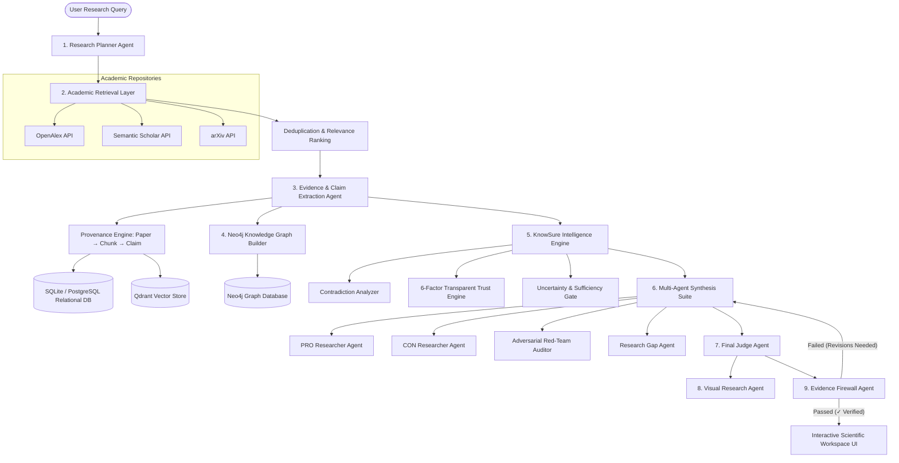

# KnowSure System Architecture & Technical Specification

## 1. System Philosophy & Design Core

**KnowSure** is an Advanced Autonomous AI Research Intelligence Platform designed to eliminate hallucination in scientific research synthesis.

Unlike generic LLM chatbots that generate responses from ungrounded internal weights, KnowSure enforces a strict **Zero-Hallucination Protocol**:
- **Fact-level Provenance**: Every claim extracted from literature retains explicit metadata (`paper_id`, `doi`, `source`, `evidence_text`, `chunk_offset`).
- **Evidence Sufficiency Gate**: If peer-reviewed literature lacks empirical data for a question, KnowSure explicitly returns `INSUFFICIENT_EVIDENCE`.
- **Adversarial Red-Teaming**: Multi-agent Red Team auditors challenge conclusions across 7 vulnerability vectors.
- **Evidence Firewall**: Final Executive Synthesis reports are validated prior to user display; unbacked claims are rejected and sent back to synthesis for auto-correction.

---

## 2. Multi-Agent System Pipeline Architecture

---

## 3. Layer Specifications

### Layer 1: Research Planning & Academic Retrieval
- **Research Planner**: Formulates sub-questions, targeted queries, required evidence types, and ambiguity identification.
- **API Connectors**: Async httpx clients fetching metadata from OpenAlex, Semantic Scholar, and arXiv.
- **Deduplication Engine**: Normalizes DOIs, titles, and author strings to remove duplicates.
- **Relevance Ranker**: BM25 & semantic similarity ranking prioritizing high-impact peer-reviewed literature.

### Layer 2: Evidence Intelligence & Provenance Storage
- **Chunk Processor**: Chunks paper abstracts/full text into semantic passages.
- **Claim Extractor**: Extracts fine-grained claim statements, methodology, datasets, sample sizes, and metrics.
- **Qdrant Vector Store**: Stores semantic embeddings in `knowsure_evidence` collection for similarity retrieval.
- **SQL Data Store**: Relational tables for `research_sessions`, `papers`, `claims`, `evidence_items`, and `contradictions`.

### Layer 3: Knowledge Graph Architecture (Neo4j)
- **Node Types**: `Paper`, `Author`, `Claim`, `Evidence`, `Dataset`, `Method`, `Result`.
- **Relationship Types**: `AUTHORED`, `CONTAINS_CLAIM`, `SUPPORTED_BY`, `CONTRADICTS`, `USES_DATASET`, `USES_METHOD`, `REPORTS_RESULT`.
- **Cypher Queries**: Fast graph traversal for multi-hop evidence tracing (`Paper` → `Claim` → `Evidence` → `Dataset`).

### Layer 4: Intelligence Engine
- **Contradiction Detector**: Identifies Direct Opposition, Quantitative Variance, Scope Mismatch, and Methodological Incompatibility.
- **Transparent Trust Engine**: Weighted multi-factor score:
  - Evidence Quality (25%)
  - Source Reliability (20%)
  - Independent Agreement (20%)
  - Methodology Quality (15%)
  - Reproducibility (10%)
  - Citation Support (10%)
- **Uncertainty Engine**: Classifies knowns, unknowns, missing evidence, and confidence bounds (`HIGH_CONFIDENCE`, `MODERATE_CONFIDENCE`, `UNCERTAIN`, `INSUFFICIENT_EVIDENCE`).

### Layer 5: Multi-Agent Adversarial Suite & Judge
- **PRO Researcher Agent**: Aggregates supporting evidence & methodologies.
- **CON Researcher Agent**: Aggregates counter-evidence, limitations, & scope boundaries.
- **Red-Team Agent**: Attacks conclusions across 7 vulnerability vectors (Data Bias, Over-generalization, Metric Mismatch, Confounding Factors, Citation Inflation, Sample Leakage, Logical Fallacies).
- **Research Gap Agent**: Identifies unstudied intersections & missing empirical data.
- **Judge Agent**: Synthesizes all evidence, trust metrics, red-team attacks, and renders final verdict classification.

### Layer 6: Visual Research Engine
- **Concept Extraction**: Extracts scientific entities, variables, datasets, and metrics.
- **Diagram Generation**: Builds interactive Methodology Flowcharts, Timelines, and Evidence Networks.
- **Animation Schema**: Outputs structured keyframe payloads (`AnimationSchema`) ready for headless animation renderers (Manim/Remotion).

### Layer 7: Evidence Firewall
- **7 Verification Checks**: Verifies claim citations, paper DOIs, conclusion alignment, confidence bounds, and omitted counter-evidence.
- **Correction Loop**: Rejects unbacked reports and returns them to synthesis for auto-correction before user presentation.
